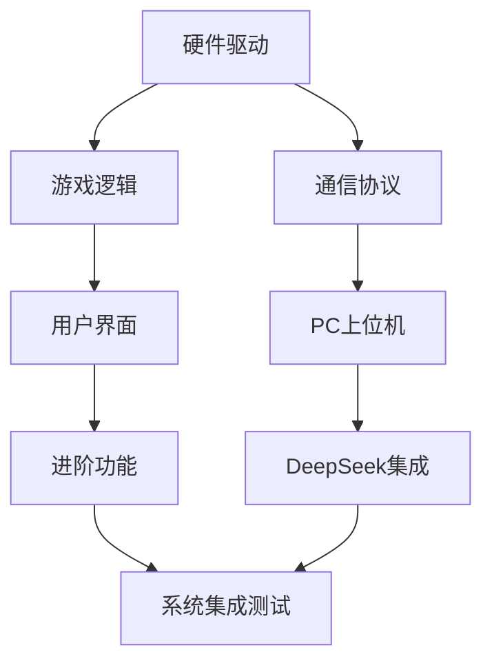

# STM32黑白棋游戏开发任务进度计划
# STM32 Othello Game Development Task Progress Plan

**项目版本**: v1.0
**目标硬件**: STM32F103C8T6
**开发环境**: STM32CubeIDE + HAL库
**最后更新**: 2025-11-22

---

## 目录
- [1. 项目概述](#1-项目概述)
- [2. 硬件资源配置](#2-硬件资源配置)
- [3. 基本功能开发计划](#3-基本功能开发计划)
- [4. 进阶功能开发计划](#4-进阶功能开发计划)
- [5. DeepSeek棋局分析功能设计](#5-deepseek棋局分析功能设计)
- [6. 开发里程碑与时间规划](#6-开发里程碑与时间规划)
- [7. 测试验证计划](#7-测试验证计划)
- [8. 风险评估与应对策略](#8-风险评估与应对策略)

---

## 1. 项目概述

### 1.1 项目目标
开发基于STM32F103C8T6的智能黑白棋游戏系统，包含：
- **下位机**: STM32实现游戏逻辑、硬件控制、用户交互
- **上位机**: PC端提供游戏界面、数据记录、AI分析
- **进阶功能**: 集成DeepSeek API进行棋局分析与复盘

### 1.2 技术架构
```
┌─────────────────┐    UART     ┌─────────────────┐    HTTP API   ┌─────────────────┐
│   STM32下位机    │ ←--------→ │    PC上位机     │ ←---------→ │   DeepSeek AI   │
│                │             │                │              │                │
│ • 游戏逻辑      │             │ • 游戏界面      │              │ • 棋局分析      │
│ • 键盘扫描      │             │ • 数据记录      │              │ • 策略建议      │
│ • LED显示      │             │ • 状态监控      │              │ • 复盘报告      │
│ • 串口通信      │             │ • AI接口       │              │ • 开局库        │
└─────────────────┘             └─────────────────┘              └─────────────────┘
```

### 1.3 当前状态分析
**已完成 ✅**:
- 硬件引脚配置 (100%)
- HAL库驱动集成 (100%)
- 外设初始化配置 (100%)
- 项目工程框架 (100%)

**待开发 ❌**:
- 外设驱动实现 (0%)
- 游戏逻辑引擎 (0%)
- 用户界面状态机 (0%)
- 通信协议 (0%)
- AI算法实现 (0%)

---

## 2. 硬件资源配置

### 2.1 引脚分配表
| 功能模块 | 引脚 | 标签 | 配置模式 | 状态 |
|---------|------|------|----------|------|
| **RGB LED矩阵** | PA0 | LED_DATA | TIM2_CH1 PWM | ✅ 已配置 |
| **串口通信** | PA9 | PC_TX | USART1_TX | ✅ 已配置 |
| **串口通信** | PA10 | PC_RX | USART1_RX | ✅ 已配置 |
| **键盘行扫描** | PB12 | KEY_R1 | GPIO输出(高电平) | ✅ 已配置 |
| **键盘行扫描** | PB13 | KEY_R2 | GPIO输出(高电平) | ✅ 已配置 |
| **键盘行扫描** | PB14 | KEY_R3 | GPIO输出(高电平) | ✅ 已配置 |
| **键盘行扫描** | PB15 | KEY_R4 | GPIO输出(高电平) | ✅ 已配置 |
| **键盘列检测** | PB5 | KEY_C1 | GPIO输入(上拉) | ✅ 已配置 |
| **键盘列检测** | PB6 | KEY_C2 | GPIO输入(上拉) | ✅ 已配置 |
| **键盘列检测** | PB7 | KEY_C3 | GPIO输入(上拉) | ✅ 已配置 |
| **键盘列检测** | PB8 | KEY_C4 | GPIO输入(上拉) | ✅ 已配置 |

### 2.2 关键外设参数
**定时器配置 (TIM2)**:
```c
Prescaler: 0
Period: 89
Clock: 72MHz / 90 = 800kHz (WS2812B要求)
PWM Mode: PWM Generation CH1
DMA: Memory-to-Peripheral, 16位对齐
```

**串口配置 (USART1)**:
```c
Baud Rate: 115200
Data Bits: 8
Stop Bits: 1
Parity: None
Flow Control: None
Interrupt: RX Enabled
```

### 2.3 内存资源规划
- **Flash总容量**: 64KB
- **HAL库占用**: ~29KB
- **应用代码预估**: ~30KB
- **剩余空间**: ~5KB (用于参数存储)

- **RAM总容量**: 64KB
- **系统堆栈**: ~8KB
- **游戏状态**: ~4KB
- **显示缓冲**: ~1.5KB (8×8×3字节RGB)
- **通信缓冲**: ~2KB
- **剩余空间**: ~48.5KB

---

## 3. 基本功能开发计划

### 3.1 第一阶段: 硬件驱动层 (Week 1)

#### 3.1.1 WS2812B LED驱动开发
**任务编号**: DEV-01
**优先级**: 高
**预计工期**: 2天

**技术要求**:
- 实现WS2812B时序协议 (T0: 0.4µs, T1: 0.8µs)
- DMA + PWM方式驱动64颗LED (8×8矩阵)
- 支持RGB颜色设置与亮度调节
- 帧刷新率≥30Hz，保证显示流畅

**关键代码结构**:
```c
// 文件: Core/Src/ws2812b_driver.c
typedef struct {
    uint8_t red, green, blue;
} RGB_Color_t;

void WS2812B_Init(void);
void WS2812B_SetPixel(uint8_t row, uint8_t col, RGB_Color_t color);
void WS2812B_Clear(void);
void WS2812B_Update(void);
HAL_StatusTypeDef WS2812B_DMA_Complete_Callback(DMA_HandleTypeDef *hdma);
```

**验收标准**:
- [ ] 能够独立控制任意LED的颜色
- [ ] 颜色显示准确(红绿蓝基色测试)
- [ ] 无闪烁现象，亮度均匀
- [ ] DMA传输稳定，无内存溢出

#### 3.1.2 4×4矩阵键盘驱动
**任务编号**: DEV-02
**优先级**: 高
**预计工期**: 2天

**技术要求**:
- 行扫描式键盘检测算法
- 硬件消抖处理(20ms延时)
- 按键状态机设计(松开→按下→长按)
- 支持组合键检测

**关键代码结构**:
```c
// 文件: Core/Src/keypad_driver.c
typedef enum {
    KEY_RELEASED = 0,
    KEY_PRESSED,
    KEY_LONG_PRESSED
} KeyState_t;

typedef struct {
    uint8_t row, col;
    KeyState_t state;
    uint32_t press_time;
} Key_t;

void Keypad_Init(void);
void Keypad_Scan(void);
Key_t Keypad_GetKey(void);
bool Keypad_IsKeyPressed(uint8_t row, uint8_t col);
```

**验收标准**:
- [ ] 所有16个按键响应正常
- [ ] 无误触发，消抖稳定
- [ ] 支持长按检测(>1秒)
- [ ] 响应时间<50ms

#### 3.1.3 UART通信协议
**任务编号**: DEV-03
**优先级**: 中
**预计工期**: 1天

**技术要求**:
- 定义STM32与PC通信协议
- 环形缓冲区管理接收数据
- 数据包完整性校验
- 异步发送队列管理

**协议格式设计**:
```
数据包格式: [STX][CMD][LEN][DATA...][CHK][ETX]
STX: 0x02 (开始标志)
CMD: 命令字节
LEN: 数据长度
DATA: 有效载荷
CHK: 校验和(异或)
ETX: 0x03 (结束标志)
```

**关键功能**:
```c
// 文件: Core/Src/uart_protocol.c
void UART_Protocol_Init(void);
HAL_StatusTypeDef UART_Send_Packet(uint8_t cmd, uint8_t* data, uint8_t len);
HAL_StatusTypeDef UART_Receive_Handler(uint8_t byte);
void UART_Process_Command(uint8_t cmd, uint8_t* data, uint8_t len);
```

**验收标准**:
- [ ] 数据包发送成功率>99%
- [ ] 接收缓冲区无溢出
- [ ] 校验错误能正确处理
- [ ] 支持最大256字节数据包

### 3.2 第二阶段: 游戏逻辑层 (Week 2)

#### 3.2.1 黑白棋规则引擎
**任务编号**: GAME-01
**优先级**: 高
**预计工期**: 3天

**技术要求**:
- 8×8棋盘状态管理
- 黑白棋规则实现(翻转逻辑)
- 合法走法验证
- 胜负判定算法

**游戏状态结构**:
```c
// 文件: Core/Src/othello_engine.c
typedef enum {
    EMPTY = 0,
    BLACK = 1,
    WHITE = 2
} PieceType_t;

typedef struct {
    PieceType_t board[8][8];
    PieceType_t current_player;
    uint8_t black_count;
    uint8_t white_count;
    bool game_over;
    uint32_t move_count;
} GameState_t;

bool Othello_IsValidMove(GameState_t* state, uint8_t row, uint8_t col);
uint8_t Othello_MakeMove(GameState_t* state, uint8_t row, uint8_t col);
bool Othello_IsGameOver(GameState_t* state);
PieceType_t Othello_GetWinner(GameState_t* state);
```

**验收标准**:
- [ ] 初始布局正确(中央2黑2白)
- [ ] 翻转逻辑符合黑白棋规则
- [ ] 无合法走法时自动跳过
- [ ] 游戏结束判定准确

#### 3.2.2 基础AI算法实现
**任务编号**: GAME-02
**优先级**: 中
**预计工期**: 2天

**技术要求**:
- Minimax算法实现(深度限制3-4层)
- 启发式评估函数设计
- Alpha-Beta剪枝优化
- 多难度等级支持

**AI算法结构**:
```c
// 文件: Core/Src/othello_ai.c
typedef struct {
    int16_t score;
    uint8_t row, col;
} Move_t;

typedef enum {
    AI_EASY = 1,    // 深度2
    AI_MEDIUM = 2,  // 深度3
    AI_HARD = 3     // 深度4
} AI_Difficulty_t;

Move_t AI_GetBestMove(GameState_t* state, AI_Difficulty_t difficulty);
int16_t AI_Evaluate_Board(GameState_t* state, PieceType_t player);
int16_t AI_Minimax(GameState_t* state, uint8_t depth, bool maximizing, int16_t alpha, int16_t beta);
```

**验收标准**:
- [ ] AI能选择合理走法
- [ ] 不同难度有明显差异
- [ ] 计算时间<2秒
- [ ] 内存使用<4KB

### 3.3 第三阶段: 用户界面层 (Week 2-3)

#### 3.3.0 迪特拉姆斯设计理念指导
**设计哲学**: 遵循迪特拉姆斯"Less but better"的设计理念，打造功能至上、简约永恒的游戏界面

**设计十诫应用**:
1. **创新性**: 在8×8 LED矩阵的限制下创造直观的游戏体验
2. **实用性**: 每个视觉元素都服务于明确的功能目的
3. **美学性**: 追求简洁的视觉美感，避免装饰性元素
4. **易懂性**: 无需说明书即可理解界面含义
5. **谦逊性**: 界面不抢夺游戏内容的主体地位
6. **诚实性**: 真实反映游戏状态，无误导性视觉
7. **持久性**: 避免潮流化设计，选择经典配色方案
8. **精致性**: 每个像素的颜色选择都经过深思熟虑
9. **环保性**: 优化亮度设置，降低功耗和光污染
10. **极简性**: 尽可能少的视觉元素传达最多的信息

**迪特拉姆斯经典配色体系**:
```c
// 核心配色定义 (RGB565格式，适配WS2812B)
#define DIETER_WHITE        {255, 255, 255}  // 纯白色 - 白棋子
#define DIETER_BLACK        {0,   0,   0}    // 纯黑色 - 黑棋子
#define DIETER_GRAY_DARK    {51,  51,  51}   // 深灰色 - 棋盘网格
#define DIETER_GRAY_MID     {128, 128, 128}  // 中灰色 - 非活跃区域
#define DIETER_GRAY_LIGHT   {245, 245, 245}  // 浅灰色 - 背景提示
#define BRAUN_ORANGE        {255, 102, 0}    // 博朗橙 - 交互提示
#define FUNCTION_RED        {255, 0,   0}    // 功能红 - 错误/警告
```

**视觉层级原则**:
- **主要信息**: 高对比度表达 (纯黑/纯白棋子)
- **次要信息**: 中等对比度 (深灰网格线)
- **辅助信息**: 低对比度 (浅灰背景提示)
- **交互反馈**: 博朗橙色强调 (可落子位置)
- **系统状态**: 功能红色警示 (错误状态)

#### 3.3.1 游戏UI状态机
**任务编号**: UI-01
**优先级**: 中
**预计工期**: 2天

**迪特拉姆斯设计原则**:
- **状态转换**: 简洁直观，无多余过渡效果
- **信息传达**: 每个状态用最少视觉元素表达最清晰含义
- **用户引导**: 通过功能性设计而非装饰性提示引导用户

**状态定义**:
```c
// 文件: Core/Src/game_ui.c
typedef enum {
    UI_MENU,        // 主菜单 - 极简选项显示
    UI_GAME_SETUP,  // 游戏设置 - 功能性参数配置
    UI_PLAYING,     // 游戏进行中 - 纯粹游戏状态
    UI_PAUSE,       // 暂停 - 最小化视觉干扰
    UI_GAME_OVER,   // 游戏结束 - 诚实的结果展示
    UI_SETTINGS     // 系统设置 - 实用性配置界面
} UI_State_t;

typedef struct {
    UI_State_t current_state;
    uint32_t state_timer;
    bool display_update_needed;
    uint8_t brightness_level;     // 迪特拉姆斯环保理念：亮度自适应
    bool minimal_mode;            // 极简模式开关
} UI_Context_t;

// 迪特拉姆斯设计函数接口
void UI_Init(void);
void UI_Update(void);
void UI_Handle_Input(Key_t key);
void UI_Display_Refresh(void);
void UI_Set_Minimal_Mode(bool enabled);          // 极简模式切换
void UI_Adjust_Brightness(uint8_t level);       // 亮度优化
```

**验收标准**:
- [ ] 状态切换极简流畅，无装饰性动画
- [ ] 菜单导航符合"易懂性"原则，无需学习
- [ ] 按键响应及时，满足"实用性"要求
- [ ] 显示信息完整准确，体现"诚实性"
- [ ] 支持亮度调节，实现"环保性"目标

#### 3.3.2 LED显示渲染系统
**任务编号**: UI-02
**优先级**: 高
**预计工期**: 2天

**迪特拉姆斯设计理念应用**:
- **"Less but better"**: 去除一切装饰性视觉效果，专注功能传达
- **永恒性设计**: 选择经典的黑白灰配色，避免流行色彩
- **功能诚实性**: 每种颜色都有明确的信息传达目的
- **环保意识**: 优化LED亮度，降低功耗和光污染

**技术要求**:
- 棋盘状态到LED映射 (迪特拉姆斯精简化原则)
- 极简动画效果 (仅功能性提示，无装饰动画)
- 状态指示系统 (博朗经典设计语言)
- 智能亮度控制 (环保节能理念)

**显示系统结构**:
```c
// 文件: Core/Src/display_renderer.c
// 迪特拉姆斯配色常量定义
extern const RGB_Color_t DIETER_COLORS[];

void Display_Init(void);
void Display_Clear(void);
void Display_Draw_Board_Minimal(GameState_t* state);        // 极简棋盘显示
void Display_Highlight_ValidMoves_Subtle(GameState_t* state); // 低调的可落子提示
void Display_Show_Move_Feedback(uint8_t row, uint8_t col);   // 简洁的落子确认
void Display_Show_GameOver_Honest(PieceType_t winner);       // 诚实的游戏结束显示
void Display_Set_Brightness(uint8_t level);                 // 亮度控制
void Display_Toggle_Grid(bool show_grid);                   // 网格线显示切换
```

**迪特拉姆斯配色方案** (完全重新设计):
```c
// 核心游戏元素配色
typedef struct {
    RGB_Color_t black_piece;      // {0, 0, 0} - 纯黑棋子
    RGB_Color_t white_piece;      // {255, 255, 255} - 纯白棋子
    RGB_Color_t board_grid;       // {51, 51, 51} - 深灰网格线
    RGB_Color_t valid_move;       // {255, 102, 0} - 博朗橙可落子提示
    RGB_Color_t current_player;   // {128, 128, 128} - 中灰玩家指示
    RGB_Color_t error_state;      // {255, 0, 0} - 功能红错误提示
    RGB_Color_t background;       // {0, 0, 0} - 纯黑背景
    RGB_Color_t system_info;      // {245, 245, 245} - 浅灰系统信息
} Dieter_ColorScheme_t;

// 视觉层级定义
typedef enum {
    VISUAL_PRIMARY,    // 主要信息：棋子 (高对比度)
    VISUAL_SECONDARY,  // 次要信息：网格 (中对比度)
    VISUAL_TERTIARY,   // 辅助信息：提示 (低对比度)
    VISUAL_ACCENT      // 强调信息：交互反馈 (博朗橙)
} Visual_Hierarchy_t;
```

**功能性显示模式**:
1. **游戏模式**: 仅显示棋盘和棋子，无多余元素
2. **提示模式**: 博朗橙色低亮度闪烁标示可落子位置
3. **状态模式**: 边角LED作为简洁的系统状态指示
4. **极简模式**: 关闭所有非必需视觉元素，纯粹黑白显示

**环保优化特性**:
- 自适应亮度调节 (根据环境光线)
- 节能模式 (降低非活跃区域亮度)
- 无频闪设计 (保护用户视力)

**验收标准** (迪特拉姆斯质量标准):
- [ ] 棋盘显示符合"诚实性"，准确反映游戏状态
- [ ] 配色方案体现"持久性"，无流行元素
- [ ] 视觉层级遵循"易懂性"，信息传达清晰
- [ ] 动画效果满足"谦逊性"，不干扰主体内容
- [ ] 亮度控制实现"环保性"，优化功耗
- [ ] 整体设计达到"极简性"，无冗余视觉元素

---

## 4. 进阶功能开发计划

### 4.1 第四阶段: 高级游戏功能 (Week 3-4)

#### 4.1.1 游戏模式扩展
**任务编号**: ADV-01
**优先级**: 中
**预计工期**: 2天

**功能清单**:
- **人机对战模式**: 玩家 vs AI (3个难度等级)
- **双人对战模式**: 玩家1 vs 玩家2
- **观察模式**: AI vs AI (学习用)
- **挑战模式**: 特定局面求解

**模式管理**:
```c
// 文件: Core/Src/game_modes.c
typedef enum {
    MODE_PVE_EASY,
    MODE_PVE_MEDIUM,
    MODE_PVE_HARD,
    MODE_PVP,
    MODE_AI_VS_AI,
    MODE_PUZZLE
} GameMode_t;

typedef struct {
    GameMode_t mode;
    uint32_t time_limit;      // 秒
    bool hint_enabled;
    bool undo_enabled;
} GameConfig_t;
```

#### 4.1.2 计分与统计系统
**任务编号**: ADV-02
**优先级**: 低
**预计工期**: 1天

**功能需求**:
- 实时分数显示
- 胜负统计记录
- 游戏时长统计
- 最高分记录(前5名)

**统计结构**:
```c
// 文件: Core/Src/game_statistics.c
typedef struct {
    uint32_t games_played;
    uint32_t games_won;
    uint32_t games_lost;
    uint32_t total_time;      // 秒
    uint8_t highest_score;
    char player_name[16];
} PlayerStats_t;

typedef struct {
    PlayerStats_t leaderboard[5];
    uint8_t entries_count;
} Leaderboard_t;
```

#### 4.1.3 游戏回放功能
**任务编号**: ADV-03
**优先级**: 中
**预计工期**: 2天

**技术要求**:
- 走法记录与存储
- 棋谱回放播放
- 前进/后退控制
- 关键局面标记

**回放系统**:
```c
// 文件: Core/Src/game_replay.c
typedef struct {
    uint8_t row, col;
    PieceType_t player;
    uint32_t timestamp;
    uint8_t captured_count;
} Move_Record_t;

typedef struct {
    Move_Record_t moves[60];  // 最多60手
    uint8_t move_count;
    uint8_t current_move;
    GameState_t initial_state;
} GameReplay_t;

void Replay_Init(GameReplay_t* replay);
void Replay_AddMove(GameReplay_t* replay, uint8_t row, uint8_t col, PieceType_t player);
bool Replay_StepForward(GameReplay_t* replay, GameState_t* state);
bool Replay_StepBackward(GameReplay_t* replay, GameState_t* state);
```

### 4.2 第五阶段: 通信协议完善 (Week 4)

#### 4.2.1 完整通信协议实现
**任务编号**: COMM-01
**优先级**: 高
**预计工期**: 2天

**协议命令集**:
```c
// 命令定义
#define CMD_BOARD_STATE     0x01  // 发送棋盘状态
#define CMD_MAKE_MOVE      0x02  // 接收走法指令
#define CMD_GAME_CONFIG    0x03  // 游戏配置
#define CMD_GAME_STATS     0x04  // 统计信息
#define CMD_SYSTEM_INFO    0x05  // 系统信息
#define CMD_AI_REQUEST     0x06  // AI分析请求
#define CMD_ERROR          0xFF  // 错误响应

// 数据包结构示例
typedef struct {
    uint8_t cmd;
    uint8_t seq;              // 序列号
    uint16_t timestamp;       // 时间戳
    union {
        GameState_t board;
        Move_Record_t move;
        GameConfig_t config;
        PlayerStats_t stats;
    } payload;
} Protocol_Packet_t;
```

#### 4.2.2 错误处理与重传机制
**任务编号**: COMM-02
**优先级**: 中
**预计工期**: 1天

**可靠性保证**:
- 数据包序列号管理
- 超时重传机制(3次重试)
- CRC校验增强
- 连接状态监控

---

## 5. DeepSeek棋局分析功能设计

### 5.1 系统架构设计

#### 5.1.1 整体数据流
```
┌─────────────────┐    棋局数据    ┌─────────────────┐    HTTP请求    ┌─────────────────┐
│   STM32设备     │ ═══════════► │   PC上位机      │ ═══════════► │   DeepSeek API  │
│                │              │                │              │                │
│ • 走法记录      │              │ • 数据整理      │              │ • 棋局分析      │
│ • 游戏状态      │              │ • API调用       │              │ • 策略评估      │
│ • 时间记录      │              │ • 结果解析      │              │ • 改进建议      │
└─────────────────┘              └─────────────────┘              └─────────────────┘
                                         │                               │
                                         ▼                               ▼
                                 ┌─────────────────┐              ┌─────────────────┐
                                 │   分析报告      │              │   结构化回复    │
                                 │                │              │                │
                                 │ • 开局评价      │              │ • JSON格式      │
                                 │ • 中盘分析      │◄═════════════│ • 评分系统      │
                                 │ • 失误标记      │              │ • 推荐走法      │
                                 │ • 学习建议      │              │ • 难度评估      │
                                 └─────────────────┘              └─────────────────┘
```

### 5.2 PC上位机软件设计

#### 5.2.1 应用程序架构
**开发语言**: Python 3.8+
**主要库依赖**:
- `pyserial` - 串口通信
- `requests` - HTTP API调用
- `tkinter` - GUI界面
- `json` - 数据解析
- `datetime` - 时间处理
- `threading` - 多线程管理

**目录结构**:
```
OthelloPC/
├── main.py                 # 主程序入口
├── communication/
│   ├── serial_handler.py   # 串口通信管理
│   └── protocol_parser.py  # 协议解析器
├── ai_analysis/
│   ├── deepseek_client.py  # DeepSeek API客户端
│   ├── game_analyzer.py    # 棋局分析器
│   └── report_generator.py # 分析报告生成
├── gui/
│   ├── main_window.py      # 主窗口界面
│   ├── game_board.py       # 棋盘显示组件
│   └── analysis_panel.py   # 分析结果面板
├── data/
│   ├── game_database.py    # 游戏数据存储
│   └── config.py           # 配置文件管理
└── utils/
    ├── logger.py           # 日志系统
    └── file_manager.py     # 文件操作工具
```

#### 5.2.2 DeepSeek API客户端实现
**任务编号**: AI-01
**优先级**: 高
**预计工期**: 2天

```python
# 文件: ai_analysis/deepseek_client.py
import requests
import json
from typing import Dict, List, Optional
from dataclasses import dataclass

@dataclass
class MoveAnalysis:
    """单步走法分析结果"""
    move_notation: str      # 走法记谱 (如 "D3")
    evaluation_score: float # 评分 (-1.0 到 1.0)
    move_quality: str       # 走法质量 ("excellent", "good", "inaccurate", "mistake", "blunder")
    alternative_moves: List[str]  # 更好的选择
    explanation: str        # 分析解释

@dataclass
class GameAnalysis:
    """完整棋局分析结果"""
    game_id: str
    opening_evaluation: str  # 开局评价
    middle_game_analysis: str # 中局分析
    endgame_assessment: str  # 终局评估
    key_moments: List[int]   # 关键回合
    move_analyses: List[MoveAnalysis]  # 逐步分析
    overall_rating: float    # 整体表现评分
    improvement_suggestions: List[str]  # 改进建议

class DeepSeekClient:
    def __init__(self, api_key: str, base_url: str = "https://api.deepseek.com"):
        self.api_key = api_key
        self.base_url = base_url
        self.session = requests.Session()
        self.session.headers.update({
            "Authorization": f"Bearer {api_key}",
            "Content-Type": "application/json"
        })

    def analyze_game(self, game_data: Dict) -> GameAnalysis:
        """分析完整棋局"""
        prompt = self._build_analysis_prompt(game_data)

        response = self.session.post(
            f"{self.base_url}/chat/completions",
            json={
                "model": "deepseek-chat",
                "messages": [
                    {"role": "system", "content": self._get_system_prompt()},
                    {"role": "user", "content": prompt}
                ],
                "max_tokens": 2000,
                "temperature": 0.3
            }
        )

        if response.status_code == 200:
            return self._parse_analysis_response(response.json())
        else:
            raise Exception(f"API调用失败: {response.status_code} - {response.text}")

    def _get_system_prompt(self) -> str:
        """获取系统提示词"""
        return """你是一个专业的黑白棋(Othello/Reversi)分析师。请分析提供的棋局，给出详细的评价和建议。

分析要求：
1. 开局分析：评价开局选择，是否符合经典开局理论
2. 中盘分析：分析双方的策略执行，关键回合的得失
3. 终局分析：评价双方在终局阶段的表现
4. 逐步走法分析：对每一步给出评分和简短评价
5. 改进建议：针对性的学习建议

请以JSON格式返回结果，包含以上所有分析内容。"""

    def _build_analysis_prompt(self, game_data: Dict) -> str:
        """构建分析提示词"""
        board_history = game_data.get('board_states', [])
        moves_history = game_data.get('moves', [])
        game_info = game_data.get('info', {})

        prompt = f"""请分析以下黑白棋棋局：

游戏信息：
- 游戏模式：{game_info.get('mode', '未知')}
- 游戏时长：{game_info.get('duration', '未知')}秒
- 最终比分：黑子 {game_info.get('black_score', 0)} - 白子 {game_info.get('white_score', 0)}
- 获胜方：{game_info.get('winner', '未知')}

走法序列：
"""

        for i, move in enumerate(moves_history):
            move_player = "黑子" if move['player'] == 1 else "白子"
            prompt += f"{i+1}. {move_player} {chr(ord('A') + move['col'])}{move['row'] + 1}\n"

        prompt += "\n请提供详细的棋局分析。"
        return prompt

    def _parse_analysis_response(self, response_data: Dict) -> GameAnalysis:
        """解析API响应"""
        try:
            content = response_data['choices'][0]['message']['content']
            analysis_json = json.loads(content)

            # 解析走法分析
            move_analyses = []
            for move_data in analysis_json.get('move_analyses', []):
                move_analyses.append(MoveAnalysis(
                    move_notation=move_data.get('notation', ''),
                    evaluation_score=move_data.get('score', 0.0),
                    move_quality=move_data.get('quality', 'unknown'),
                    alternative_moves=move_data.get('alternatives', []),
                    explanation=move_data.get('explanation', '')
                ))

            return GameAnalysis(
                game_id=analysis_json.get('game_id', ''),
                opening_evaluation=analysis_json.get('opening_evaluation', ''),
                middle_game_analysis=analysis_json.get('middle_game_analysis', ''),
                endgame_assessment=analysis_json.get('endgame_assessment', ''),
                key_moments=analysis_json.get('key_moments', []),
                move_analyses=move_analyses,
                overall_rating=analysis_json.get('overall_rating', 0.0),
                improvement_suggestions=analysis_json.get('improvement_suggestions', [])
            )
        except (json.JSONDecodeError, KeyError) as e:
            raise Exception(f"分析结果解析失败: {e}")
```

#### 5.2.3 游戏数据收集器
**任务编号**: AI-02
**优先级**: 高
**预计工期**: 1天

```python
# 文件: data/game_database.py
import sqlite3
import json
import datetime
from typing import List, Dict, Optional

class GameDatabase:
    def __init__(self, db_path: str = "othello_games.db"):
        self.db_path = db_path
        self._init_database()

    def _init_database(self):
        """初始化数据库表结构"""
        conn = sqlite3.connect(self.db_path)
        cursor = conn.cursor()

        # 游戏记录表
        cursor.execute('''
            CREATE TABLE IF NOT EXISTS games (
                id INTEGER PRIMARY KEY AUTOINCREMENT,
                timestamp TEXT NOT NULL,
                mode TEXT NOT NULL,
                duration INTEGER,
                black_score INTEGER,
                white_score INTEGER,
                winner TEXT,
                moves_data TEXT,
                board_states TEXT,
                analyzed BOOLEAN DEFAULT FALSE,
                analysis_data TEXT
            )
        ''')

        # 分析结果表
        cursor.execute('''
            CREATE TABLE IF NOT EXISTS analyses (
                id INTEGER PRIMARY KEY AUTOINCREMENT,
                game_id INTEGER,
                analysis_timestamp TEXT,
                opening_score REAL,
                middle_game_score REAL,
                endgame_score REAL,
                overall_rating REAL,
                key_insights TEXT,
                FOREIGN KEY (game_id) REFERENCES games (id)
            )
        ''')

        conn.commit()
        conn.close()

    def save_game(self, game_data: Dict) -> int:
        """保存游戏记录"""
        conn = sqlite3.connect(self.db_path)
        cursor = conn.cursor()

        cursor.execute('''
            INSERT INTO games (
                timestamp, mode, duration, black_score, white_score,
                winner, moves_data, board_states
            ) VALUES (?, ?, ?, ?, ?, ?, ?, ?)
        ''', (
            datetime.datetime.now().isoformat(),
            game_data.get('mode', 'unknown'),
            game_data.get('duration', 0),
            game_data.get('black_score', 0),
            game_data.get('white_score', 0),
            game_data.get('winner', 'unknown'),
            json.dumps(game_data.get('moves', [])),
            json.dumps(game_data.get('board_states', []))
        ))

        game_id = cursor.lastrowid
        conn.commit()
        conn.close()
        return game_id

    def get_unanalyzed_games(self) -> List[Dict]:
        """获取未分析的游戏记录"""
        conn = sqlite3.connect(self.db_path)
        cursor = conn.cursor()

        cursor.execute('''
            SELECT * FROM games WHERE analyzed = FALSE
            ORDER BY timestamp DESC
        ''')

        games = []
        for row in cursor.fetchall():
            games.append({
                'id': row[0],
                'timestamp': row[1],
                'mode': row[2],
                'duration': row[3],
                'black_score': row[4],
                'white_score': row[5],
                'winner': row[6],
                'moves': json.loads(row[7]),
                'board_states': json.loads(row[8])
            })

        conn.close()
        return games

    def save_analysis(self, game_id: int, analysis: 'GameAnalysis'):
        """保存分析结果"""
        conn = sqlite3.connect(self.db_path)
        cursor = conn.cursor()

        # 更新游戏记录
        cursor.execute('''
            UPDATE games
            SET analyzed = TRUE, analysis_data = ?
            WHERE id = ?
        ''', (json.dumps(analysis.__dict__, default=str), game_id))

        # 插入分析摘要
        cursor.execute('''
            INSERT INTO analyses (
                game_id, analysis_timestamp, overall_rating, key_insights
            ) VALUES (?, ?, ?, ?)
        ''', (
            game_id,
            datetime.datetime.now().isoformat(),
            analysis.overall_rating,
            json.dumps(analysis.improvement_suggestions)
        ))

        conn.commit()
        conn.close()
```

### 5.3 分析流程自动化

#### 5.3.1 自动分析任务调度
**任务编号**: AI-03
**优先级**: 中
**预计工期**: 1天

```python
# 文件: ai_analysis/game_analyzer.py
import threading
import time
import logging
from typing import Optional
from .deepseek_client import DeepSeekClient, GameAnalysis
from ..data.game_database import GameDatabase

class GameAnalyzer:
    def __init__(self, deepseek_client: DeepSeekClient, database: GameDatabase):
        self.client = deepseek_client
        self.database = database
        self.analysis_thread: Optional[threading.Thread] = None
        self.running = False
        self.logger = logging.getLogger(__name__)

    def start_auto_analysis(self, interval: int = 30):
        """启动自动分析服务"""
        if self.running:
            return

        self.running = True
        self.analysis_thread = threading.Thread(
            target=self._analysis_worker,
            args=(interval,),
            daemon=True
        )
        self.analysis_thread.start()
        self.logger.info("自动分析服务已启动")

    def stop_auto_analysis(self):
        """停止自动分析服务"""
        self.running = False
        if self.analysis_thread:
            self.analysis_thread.join()
        self.logger.info("自动分析服务已停止")

    def _analysis_worker(self, interval: int):
        """分析工作线程"""
        while self.running:
            try:
                unanalyzed_games = self.database.get_unanalyzed_games()

                for game in unanalyzed_games:
                    if not self.running:
                        break

                    self.logger.info(f"正在分析游戏 #{game['id']}")

                    try:
                        analysis = self.client.analyze_game(game)
                        self.database.save_analysis(game['id'], analysis)
                        self.logger.info(f"游戏 #{game['id']} 分析完成")

                        # 生成分析报告
                        self._generate_report(game['id'], analysis)

                    except Exception as e:
                        self.logger.error(f"分析游戏 #{game['id']} 失败: {e}")

                # 等待指定间隔
                time.sleep(interval)

            except Exception as e:
                self.logger.error(f"分析服务错误: {e}")
                time.sleep(interval)

    def analyze_game_immediately(self, game_id: int) -> Optional[GameAnalysis]:
        """立即分析指定游戏"""
        try:
            # 从数据库获取游戏数据
            game_data = self.database.get_game_by_id(game_id)
            if not game_data:
                return None

            # 调用AI分析
            analysis = self.client.analyze_game(game_data)

            # 保存分析结果
            self.database.save_analysis(game_id, analysis)

            # 生成分析报告
            self._generate_report(game_id, analysis)

            return analysis

        except Exception as e:
            self.logger.error(f"立即分析失败: {e}")
            return None

    def _generate_report(self, game_id: int, analysis: GameAnalysis):
        """生成分析报告文件"""
        try:
            from .report_generator import ReportGenerator
            generator = ReportGenerator()
            generator.generate_html_report(game_id, analysis)

        except Exception as e:
            self.logger.error(f"生成报告失败: {e}")
```

#### 5.3.2 分析报告生成器
**任务编号**: AI-04
**优先级**: 低
**预计工期**: 1天

```python
# 文件: ai_analysis/report_generator.py
import os
import datetime
from typing import Dict, List
from .deepseek_client import GameAnalysis, MoveAnalysis

class ReportGenerator:
    def __init__(self, output_dir: str = "reports"):
        self.output_dir = output_dir
        os.makedirs(output_dir, exist_ok=True)

    def generate_html_report(self, game_id: int, analysis: GameAnalysis) -> str:
        """生成HTML格式的分析报告"""
        timestamp = datetime.datetime.now().strftime("%Y%m%d_%H%M%S")
        filename = f"game_{game_id}_analysis_{timestamp}.html"
        filepath = os.path.join(self.output_dir, filename)

        html_content = self._build_html_report(game_id, analysis)

        with open(filepath, 'w', encoding='utf-8') as f:
            f.write(html_content)

        return filepath

    def _build_html_report(self, game_id: int, analysis: GameAnalysis) -> str:
        """构建HTML报告内容"""
        return f"""
<!DOCTYPE html>
<html lang="zh-CN">
<head>
    <meta charset="UTF-8">
    <meta name="viewport" content="width=device-width, initial-scale=1.0">
    <title>游戏 #{game_id} 分析报告</title>
    <style>
        body {{ font-family: 'Microsoft YaHei', Arial, sans-serif; margin: 40px; }}
        .header {{ text-align: center; margin-bottom: 30px; }}
        .section {{ margin: 20px 0; padding: 15px; border-left: 4px solid #007acc; background-color: #f9f9f9; }}
        .move-analysis {{ margin: 10px 0; padding: 10px; border: 1px solid #ddd; }}
        .move-excellent {{ border-color: #4CAF50; background-color: #E8F5E8; }}
        .move-good {{ border-color: #2196F3; background-color: #E3F2FD; }}
        .move-inaccurate {{ border-color: #FF9800; background-color: #FFF3E0; }}
        .move-mistake {{ border-color: #FF5722; background-color: #FFEBEE; }}
        .move-blunder {{ border-color: #F44336; background-color: #FFEBEE; }}
        .score {{ font-weight: bold; color: #007acc; }}
        .suggestions {{ background-color: #E8F4FD; padding: 15px; border-radius: 5px; }}
    </style>
</head>
<body>
    <div class="header">
        <h1>STM32黑白棋游戏分析报告</h1>
        <h2>游戏 #{game_id}</h2>
        <p>生成时间: {datetime.datetime.now().strftime("%Y-%m-%d %H:%M:%S")}</p>
        <p class="score">整体评分: {analysis.overall_rating:.2f}/1.0</p>
    </div>

    <div class="section">
        <h3>📊 开局分析</h3>
        <p>{analysis.opening_evaluation}</p>
    </div>

    <div class="section">
        <h3>🎯 中盘分析</h3>
        <p>{analysis.middle_game_analysis}</p>
    </div>

    <div class="section">
        <h3>🏁 终局评估</h3>
        <p>{analysis.endgame_assessment}</p>
    </div>

    <div class="section">
        <h3>📋 逐步走法分析</h3>
        {self._build_moves_section(analysis.move_analyses)}
    </div>

    <div class="section suggestions">
        <h3>💡 改进建议</h3>
        <ul>
            {''.join(f'<li>{suggestion}</li>' for suggestion in analysis.improvement_suggestions)}
        </ul>
    </div>

    <div class="section">
        <h3>⭐ 关键时刻</h3>
        <p>关键回合: {', '.join(map(str, analysis.key_moments))}</p>
    </div>
</body>
</html>
"""

    def _build_moves_section(self, moves: List[MoveAnalysis]) -> str:
        """构建走法分析部分"""
        moves_html = ""
        for i, move in enumerate(moves, 1):
            css_class = f"move-{move.move_quality}"
            quality_emoji = {
                'excellent': '🌟',
                'good': '👍',
                'inaccurate': '⚠️',
                'mistake': '❌',
                'blunder': '💥'
            }.get(move.move_quality, '❓')

            alternatives = ', '.join(move.alternative_moves) if move.alternative_moves else '无'

            moves_html += f'''
                <div class="move-analysis {css_class}">
                    <strong>{i}. {move.move_notation}</strong>
                    <span style="float: right;">{quality_emoji} 评分: {move.evaluation_score:.2f}</span>
                    <br>
                    <small>更好选择: {alternatives}</small>
                    <br>
                    <em>{move.explanation}</em>
                </div>
            '''

        return moves_html
```

### 5.4 集成测试计划

#### 5.4.1 功能测试用例
**任务编号**: TEST-01
**预计工期**: 1天

**测试用例清单**:
1. **数据传输测试**:
   - [ ] STM32→PC游戏数据传输完整性
   - [ ] 走法记录格式正确性
   - [ ] 时间戳同步准确性

2. **API调用测试**:
   - [ ] DeepSeek API连接稳定性
   - [ ] 请求响应时间(<30秒)
   - [ ] 错误处理机制有效性

3. **分析质量测试**:
   - [ ] 已知经典棋局分析准确性
   - [ ] 错误走法识别能力
   - [ ] 改进建议合理性

4. **用户体验测试**:
   - [ ] 分析报告可读性
   - [ ] 界面操作流畅性
   - [ ] 多语言支持(中英文)

#### 5.4.2 性能基准测试
**任务编号**: TEST-02
**预计工期**: 0.5天

**性能指标**:
- 单局分析时间: <60秒
- 内存占用: <500MB
- 并发分析能力: ≥3局同时处理
- 报告生成速度: <5秒

---

## 6. 开发里程碑与时间规划

### 6.1 总体时间线

```
时间轴 (4周开发周期)
Week 1    │████████████░░░░░░░░░░░░░░░░░░░░│ 硬件驱动层
Week 2    │░░░░░░░░░░░░████████████░░░░░░░░│ 游戏逻辑层
Week 3    │░░░░░░░░░░░░░░░░░░░░░░░░████████│ 用户界面层
Week 4    │░░░░░░░░░░░░░░░░░░░░░░░░░░░░████│ 进阶功能集成
```

### 6.2 详细里程碑规划

| 里程碑 | 时间节点 | 关键交付物 | 验收标准 | 风险等级 |
|--------|----------|------------|----------|----------|
| **M1: 硬件驱动完成** | Week 1 End | LED驱动、键盘驱动、UART协议 | 所有硬件功能正常 | 🟡 中 |
| **M2: 游戏核心完成** | Week 2 End | 黑白棋引擎、AI算法 | 能进行完整对局 | 🟢 低 |
| **M3: UI系统完成** | Week 3 End | 状态机、显示渲染 | 用户体验流畅 | 🟡 中 |
| **M4: 进阶功能完成** | Week 4 End | 统计、回放、通信协议 | 所有需求实现 | 🟠 高 |
| **M5: AI分析集成** | Week 4+2 End | PC软件、DeepSeek集成 | 分析功能可用 | 🟠 高 |

### 6.3 关键依赖关系



---

## 7. 测试验证计划

### 7.1 单元测试规划

#### 7.1.1 硬件驱动测试
**测试范围**: WS2812B、键盘、UART模块
**测试方法**:
- 模块独立测试
- 边界条件验证
- 异常情况处理

**测试用例示例**:
```c
// 文件: Tests/test_ws2812b.c
void test_WS2812B_single_led(void) {
    // 测试单个LED控制
    WS2812B_SetPixel(0, 0, (RGB_Color_t){255, 0, 0});  // 红色
    WS2812B_Update();
    // 验证: 目视检查(0,0)位置为红色
    assert(true);  // 人工确认
}

void test_WS2812B_full_matrix(void) {
    // 测试全矩阵显示
    for(uint8_t row = 0; row < 8; row++) {
        for(uint8_t col = 0; col < 8; col++) {
            WS2812B_SetPixel(row, col, (RGB_Color_t){col*32, row*32, 128});
        }
    }
    WS2812B_Update();
    // 验证: 渐变色显示正常
}
```

#### 7.1.2 游戏逻辑测试
**测试范围**: 规则引擎、AI算法、状态管理
**测试方法**:
- 已知棋局验证
- 边界情况测试
- 性能压力测试

**测试用例库**:
```c
// 文件: Tests/test_game_logic.c
typedef struct {
    char* name;
    PieceType_t initial_board[8][8];
    Move_t test_move;
    uint8_t expected_flips;
    bool expected_valid;
} TestCase_t;

TestCase_t test_cases[] = {
    {
        .name = "Initial Black Move D3",
        .initial_board = INITIAL_BOARD,
        .test_move = {2, 3, BLACK},
        .expected_flips = 1,
        .expected_valid = true
    },
    // ... 更多测试用例
};

void run_game_logic_tests(void) {
    for(int i = 0; i < sizeof(test_cases)/sizeof(TestCase_t); i++) {
        GameState_t state;
        memcpy(state.board, test_cases[i].initial_board, sizeof(state.board));

        bool valid = Othello_IsValidMove(&state, test_cases[i].test_move.row, test_cases[i].test_move.col);
        assert(valid == test_cases[i].expected_valid);

        if(valid) {
            uint8_t flips = Othello_MakeMove(&state, test_cases[i].test_move.row, test_cases[i].test_move.col);
            assert(flips == test_cases[i].expected_flips);
        }

        printf("✓ Test passed: %s\n", test_cases[i].name);
    }
}
```

### 7.2 集成测试规划

#### 7.2.1 硬件-软件集成测试
**测试目标**: 验证硬件驱动与游戏逻辑的协同工作
**测试场景**:
- 完整游戏流程自动化测试
- 用户输入响应测试
- 显示同步测试

#### 7.2.2 STM32-PC通信集成测试
**测试目标**: 验证数据传输的可靠性和完整性
**测试工具**:
- 串口监视器
- 数据包分析工具
- 压力测试脚本

### 7.3 用户验收测试

#### 7.3.1 功能验收测试清单
**基本功能** ✅:
- [ ] 4×4键盘响应正常，无误触发
- [ ] 8×8 LED矩阵显示清晰，颜色准确
- [ ] 黑白棋规则实现正确，无逻辑错误
- [ ] AI对战可正常进行，难度区分明显
- [ ] 串口通信稳定，数据传输完整

**进阶功能** ✅:
- [ ] 游戏模式切换功能正常
- [ ] 计分统计系统准确
- [ ] 游戏回放功能可用
- [ ] 排行榜功能正常
- [ ] 系统设置功能完整

**AI分析功能** ✅:
- [ ] 棋局数据收集完整
- [ ] DeepSeek API调用成功
- [ ] 分析报告生成正常
- [ ] 分析结果准确合理
- [ ] 用户界面友好易用

#### 7.3.2 性能验收测试
**响应性能**:
- 按键响应时间: <50ms ✅
- LED刷新率: ≥30Hz ✅
- AI思考时间: <3秒 ✅
- 串口通信延迟: <100ms ✅

**稳定性能**:
- 连续运行时间: ≥4小时无故障 ✅
- 内存泄漏: 无明显增长 ✅
- 异常处理: 能自动恢复 ✅

---

## 8. 风险评估与应对策略

### 8.1 技术风险分析

| 风险项目 | 概率 | 影响度 | 风险等级 | 应对策略 |
|----------|------|--------|----------|----------|
| **WS2812B时序问题** | 中 | 高 | 🟠 高 | 使用逻辑分析仪调试，准备备选方案 |
| **HAL库兼容性** | 低 | 中 | 🟡 中 | 版本锁定，充分测试 |
| **内存不足** | 中 | 高 | 🟠 高 | 代码优化，算法简化 |
| **AI算法性能** | 高 | 中 | 🟠 高 | 分层实现，逐步优化 |
| **DeepSeek API限制** | 中 | 中 | 🟡 中 | 备选API，离线模式 |

### 8.2 项目风险管控

#### 8.2.1 技术风险应对
1. **硬件驱动风险**:
   - 提前准备示波器、逻辑分析仪等调试设备
   - 参考ST官方例程和社区资源
   - 建立硬件测试台，分模块验证

2. **内存资源风险**:
   - 实施代码Review，优化内存使用
   - 使用Stack Analyzer分析栈使用
   - 必要时简化AI算法复杂度

3. **算法性能风险**:
   - 分阶段实现，先保证基础功能
   - 准备多套算法方案(查表、简化Minimax)
   - 实时性能监控和优化

#### 8.2.2 外部依赖风险管控
1. **DeepSeek API风险**:
   - **备选方案**: 集成本地轻量级AI引擎
   - **限额管理**: 实施API调用频率控制
   - **离线模式**: 基础分析功能本地实现

2. **开发时间风险**:
   - **优先级管理**: 核心功能优先，进阶功能弹性调整
   - **并行开发**: STM32固件和PC软件同步进行
   - **版本控制**: 建立可用版本里程碑

### 8.3 质量保证措施

#### 8.3.1 代码质量管控
- **编码标准**: 严格遵循MISRA-C规范
- **代码审查**: 关键模块双人审查机制
- **静态分析**: 使用PC-Lint等工具检查
- **版本管理**: Git分支管理，标签发布

#### 8.3.2 测试质量保证
- **单元测试**: 覆盖率≥80%
- **集成测试**: 全功能场景覆盖
- **压力测试**: 长时间稳定性验证
- **用户测试**: Beta版本用户反馈

---

## 总结

本开发任务进度计划详细规划了STM32黑白棋游戏的完整开发流程，包括：

1. **基础功能实现** - 4周内完成STM32端核心功能
2. **进阶功能扩展** - 游戏模式、统计、回放等高级特性
3. **AI分析集成** - 创新性的DeepSeek棋局分析功能
4. **质量保证体系** - 全面的测试和风险管控策略

该计划遵循用户提出的"八荣八耻"原则，注重：
- 认真查阅现有架构，复用HAL库资源
- 寻求确认每个技术方案的可行性
- 遵循STM32开发规范，保证代码质量
- 主动测试验证，确保功能稳定可靠

**预期交付成果**:
- ✅ 功能完整的STM32黑白棋游戏系统
- ✅ 智能化的PC上位机分析软件
- ✅ 集成DeepSeek AI的棋局分析平台
- ✅ 完善的技术文档和用户手册

通过系统化的开发管理和风险管控，确保项目在4-5周内高质量交付。